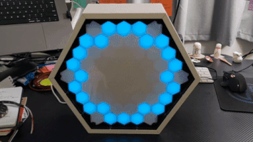
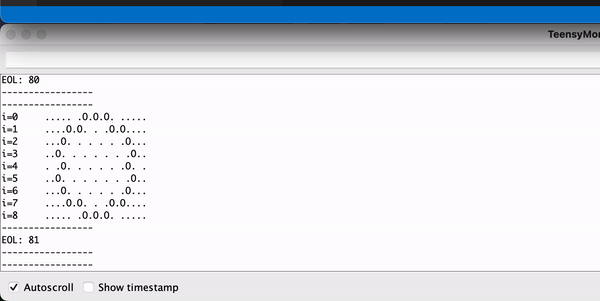
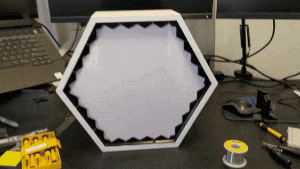
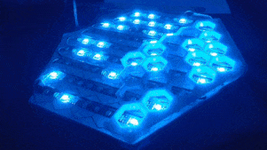

# Hexagonal Game of Life

  

This repository contains code for a hexagonal game of life being run on a [teensy 4.0](https://www.pjrc.com/store/teensy40.html) with the [teensy audio adaptor](https://www.pjrc.com/store/teensy3_audio.html).

It runs continuous game of life simulations; however, when the algorithm detects that the game is over, it will play an `ending.wav` audio track which is stored on an SD card in the audio adaptor board.

## Dependencies

This project uses [PJRC's Teensyduino IDE](https://www.pjrc.com/teensy/teensyduino.html) which already include some of the libraries required to get this project running. 

We also need [Adafruit's Adafruit_NeoPixel](https://github.com/adafruit/Adafruit_NeoPixel) library. I suggest following the link's installation instructions. 

## Debugging

The `serial_view` allows us to see the game of life on a serial terminal window.

  

## Hardware

  
  

The hardware in this project includes:
* WS2812 LED strips
* Teensy 4.0
* PJRC's Audio Adaptor shield
* 5V (3A) power supply
* A 5V Speaker with Audio jack input
* Enclosure
  * Hexagonal shelf
  * 3D printed parts
  * White plastic for diffusing the LEDs

## Algorithms

### Game of life

Each cell has between 3 to 6 neighbours (the 6 corners having 3, edges having 4 and others having 6).

On each iteration, we follow these rules:
* Life begins or continues on cells with 2 or 3 living neighbours
* Living cells with 1 or 0 living neighbours die of loneliness
* Living cells with 4 or more living neighbours die of overpopulation

These rules are similar to the square-grid game of life, but the numbers differ to work better for a hexagonal grid.

It is possible that the game of life gets stuck in a loop. This often happens once a pattern develops some symmetry.

### End of Life

An End of Life (EoL) algorithm was designed to detect when the game gets stuck in a loop. Once end of life is detected, the `ending.wav` file plays, and the game restarts near the end of the track.

The EoL algorithm is:
* On each step, calculate a `uint64_t` `entry` value which represents the current board.
  * There are 61 cells, each represented by 61 bits in the `entry` value.
* We have an `eolEntries` array, which stores 16 values:
  * Value `0` is stored on each game step
  * Value `1` is stored on every 2nd game step
  * Value `2` is stored on every 4th game step
  * Values `3` to `16` is stored on every `2^n`th game step
* On each step, we check if the current `entry` matches any of the previous values in `eolEntries`
* If it does, the End of Life sequence begins

This algorithm allows us to detect loops as long as 65536 steps long using only 128 bytes of RAM.

